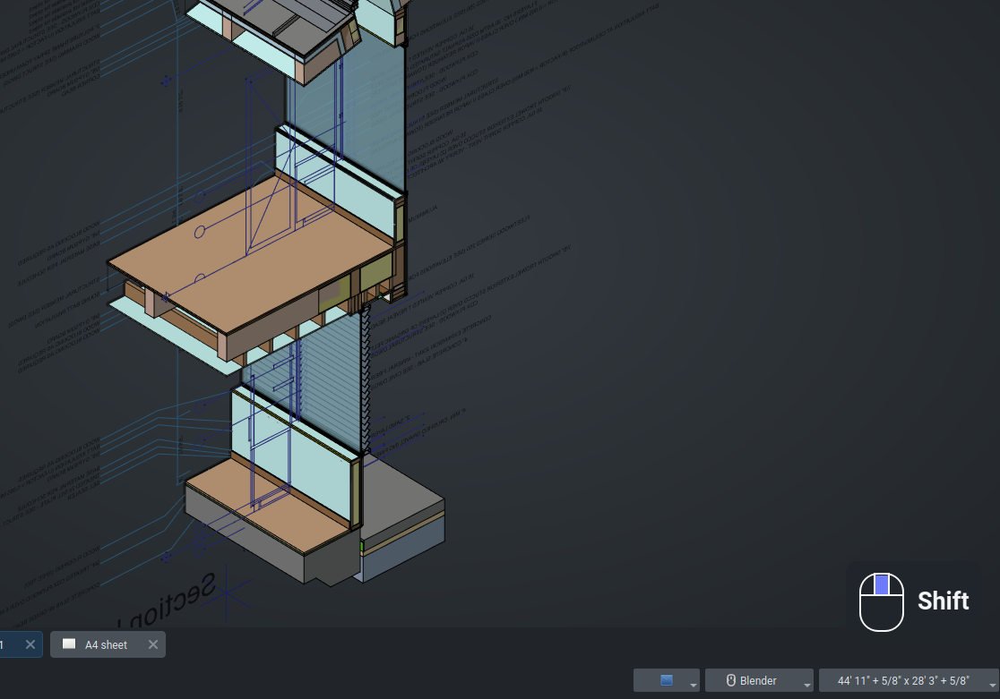

# Screencast Keys for FreeCAD

Screencast Keys displays keyboard and mouse input inside the FreeCAD window.
It is intended for tutorials, demonstrations, livestreams, and screen
recordings where viewers need to follow the presenter's input.
Coded with gpt-5.6-sol.



## Quick start

Restart FreeCAD, then open **Edit → Preferences → Screencast Keys**. Use
**Show Screencast Keys overlay now** to show or hide the overlay and configure
its position and appearance on the same page.

The add-on is inspired by Blender's [Screencast Keys](https://github.com/nutti/Screencast-Keys) and is independently
implemented with FreeCAD's Qt interface.

## Installation

Place this repository in FreeCAD's user `Mod` directory under the name
`FreeCAD-screencast-keys`.

Typical locations include:

- Linux: `~/.local/share/FreeCAD/v1-1/Mod/FreeCAD-screencast-keys`
- Windows: `%APPDATA%\FreeCAD\v1-1\Mod\FreeCAD-screencast-keys`
- macOS: `~/Library/Application Support/FreeCAD/v1-1/Mod/FreeCAD-screencast-keys`

Restart FreeCAD after copying or updating the add-on. Screencast Keys has no
third-party runtime dependencies.

## Usage

The overlay starts automatically after installation. To show or hide it at any
time, open **Edit → Preferences → Screencast Keys**, change **Show Screencast
Keys overlay**, and press **Apply** or **OK**.

## Preferences

Open **Edit → Preferences → Screencast Keys**. Changes take effect after
pressing **Apply** or **OK**.

| Setting | Purpose |
| --- | --- |
| Show Screencast Keys overlay | Enables or disables the current overlay. |
| Enable when FreeCAD starts | Controls automatic activation on future launches. |
| Show mouse button status | Shows or hides the mouse visualization. |
| Combine consecutive events | Displays repeated keys with a counter. |
| Corner | Selects the top-left, top-right, bottom-left, or bottom-right position. |
| Distance from corner | Adds space between the overlay and the window edge. |
| Keyboard font size | Changes the size of displayed key names. |
| Mouse icon width | Changes the size of the mouse visualization. |
| Keyboard text position | Places keyboard events to the left or right of the mouse. |
| Event display time | Controls how long keyboard events remain visible. |
| Maximum history | Limits the number of keyboard events shown together. |
| Background opacity | Changes the transparency of the overlay panel. |
| Colors | Configures the panel, text, outline, and active-button colors. |

Preferences are stored using FreeCAD's parameter system.

## Development

Run the automated checks from the repository root:

```bash
python3 -m compileall -q .
QT_QPA_PLATFORM=offscreen python3 -m unittest discover -s tests -v
```

The test suite covers event history, duplicate input filtering, password
redaction, mouse state, scroll direction, overlay positioning, and Qt widget
integration.

## License

Screencast Keys for FreeCAD is available under the
[GNU General Public License version 3](LICENSE).
